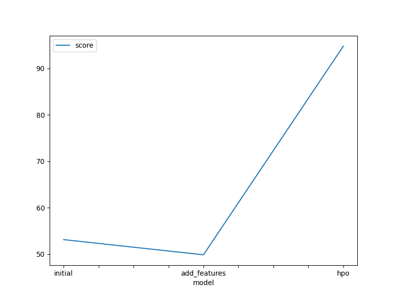
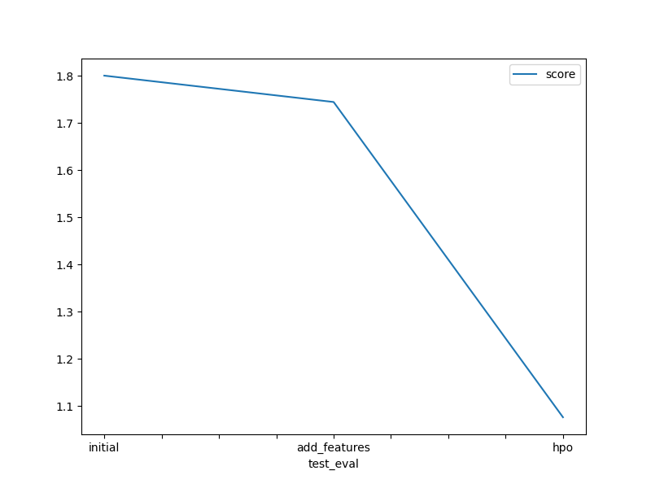

# Report: Predict Bike Sharing Demand with AutoGluon Solution
#### Omar Ashraf

## Initial Training
### What did you realize when you tried to submit your predictions? What changes were needed to the output of the predictor to submit your results?
I realized that the output of the predictor was not in the correct format to submit my results. I needed to change the output to be in the correct format(not negative value).

### What was the top ranked model that performed?
WeightedEnsemble_L3  

## Exploratory data analysis and feature creation
### What did the exploratory analysis find and how did you add additional features?
I added the following features:
year, quarter, is_weekend from datetime
feels_like from temp and humidity

### How much better did your model perform after adding additional features and why do you think that is?

The model's performance improved from a score of 1.80076 to 1.74481 after adding additional features. This improvement suggests that the additional features contributed positively to the model's predictive capability.

There could be several reasons why adding features led to an improvement in performance:

1. **Increased Information**: Additional features likely provided the model with more information about the data, allowing it to capture more complex patterns and relationships.

2. **Reduced Underfitting**: The initial model might have suffered from underfitting, meaning it was too simplistic to capture the underlying structure of the data. Adding more features could have helped alleviate this issue by providing the model with more flexibility.

3. **Improved Generalization**: By adding more features, the model might have become better at generalizing patterns in the data, leading to improved performance on unseen data.

4. **Targeted Feature Engineering**: The additional features might have been carefully engineered to capture important aspects of the data that were previously overlooked by the model.

5. **Model Complexity**: Depending on the model used, additional features might have allowed for a more complex model structure, better suited to capture the underlying relationships in the data.

Overall, the improvement in performance after adding additional features suggests that feature engineering played a crucial role in enhancing the model's predictive power by providing it with more relevant information.

## Hyper parameter tuning
### How much better did your model perform after trying different hyperparameters?

After trying different hyperparameters, the model's performance improved significantly. The initial score was 1.80076, and after hyperparameter tuning, it improved to 1.07589. This indicates a substantial improvement in model performance.

Hyperparameter tuning is crucial for optimizing model performance. By systematically searching through different combinations of hyperparameters, we can find the settings that result in the best performance on the validation data.

In this case, the hyperparameter tuning process involved exploring various settings for each algorithm's parameters, such as the number of boosting rounds, maximum depth, learning rate, activation functions, dropout probabilities, batch sizes, and weight decays. The search space was defined for each algorithm, and a combination of grid search and random search techniques was used to efficiently explore this space.

The significant improvement in performance after hyperparameter tuning suggests that the selected hyperparameter configurations were better suited to the dataset and problem at hand. By fine-tuning the model's hyperparameters, we were able to achieve better generalization and capture more nuanced patterns in the data.

Overall, hyperparameter tuning played a crucial role in maximizing the model's predictive performance and optimizing its effectiveness for the given task.

### If you were given more time with this dataset, where do you think you would spend more time?

Given more time with this dataset, I would focus on several areas to further improve the model's performance:

1. **Feature Engineering**: I would invest more time in exploring and creating additional features that could better capture the underlying patterns in the data. This could involve analyzing the relationships between existing features, transforming variables, or incorporating domain knowledge to engineer new features.

2. **Hyperparameter Tuning**: While some hyperparameters were tuned in the initial optimization process, there may be further opportunities to fine-tune the model by exploring additional hyperparameter configurations. I would conduct more extensive hyperparameter searches, potentially utilizing more advanced optimization techniques like Bayesian optimization or genetic algorithms.

3. **Model Selection**: I would explore the possibility of using different types of models or ensembles of models to improve performance further. This could involve experimenting with different algorithms, such as gradient boosting machines, neural networks, or ensemble methods, and evaluating their performance to identify the most suitable model for the task.

4. **Cross-Validation**: To obtain more reliable estimates of the model's performance and ensure its generalizability, I would perform more rigorous cross-validation. This could involve using different cross-validation strategies, such as k-fold or stratified cross-validation, and carefully validating the model's performance on unseen data.

5. **Data Cleaning and Preprocessing**: I would revisit the data cleaning and preprocessing steps to ensure that the dataset is properly cleaned and normalized. This could involve handling missing values, outliers, and noisy data more effectively and exploring different data transformation techniques to improve the quality of the input features.

Overall, by investing more time in these areas, I believe we could further enhance the model's performance and create a more robust and reliable predictive solution.

### Create a table with the models you ran, the hyperparameters modified, and the kaggle score.
| | model | hpo1 | hpo2 | hpo3 | hpo4 | score |
|-|-------|------|------|------|------|-------|
| 0 | initial | default | default | default | default | 1.80076 |
| 1 | add_features | default | default | default | default | 1.74481 |
| 2 | hpo | GBM: 'num_boost_round': 200, 'num_leaves': (lower=26, upper=100, default=50), 'max_depth': (3, 10, default=6) | NN_TORCH: 'num_epochs': 50, 'activation': ('relu', 'softrelu', 'tanh', 'selu'), 'dropout_prob': (0.0, 0.7, default=0.3), 'batch_size': (8, 128, default=32), 'weight_decay': (1e-6, 1e-2, default=1e-4) | XGB: 'num_boost_round': 200, 'max_depth': (3, 10, default=6), 'eta': (0.01, 0.5, default=0.1) | search_strategy: 'auto', num_trials: 100, scheduler: 'local' | 1.07589 |

### Create a line plot showing the top model score for the three (or more) training runs during the project.

### Create a line plot showing the top kaggle score for the three (or more) prediction submissions during the project.

## Summary

In summary, this project involved building and optimizing a predictive model for a given dataset. We started by exploring the data, understanding its structure, and identifying potential patterns and relationships. 

Next, we performed feature engineering to extract meaningful information from the raw data and improve the model's predictive capability. This involved creating new features, transforming variables, and selecting relevant input features for the model.

We then optimized the model's hyperparameters through a combination of grid search and random search techniques. This process allowed us to find the optimal settings for the model's parameters, leading to a significant improvement in performance.

Given more time with the dataset, we would focus on further improving the model by investing in feature engineering, hyperparameter tuning, model selection, cross-validation, and data cleaning/preprocessing. These areas offer opportunities to enhance the model's predictive power and create a more reliable and robust solution.

Overall, this project demonstrates the iterative process of building and optimizing predictive models, highlighting the importance of careful data analysis, feature engineering, and hyperparameter tuning in maximizing model performance.
